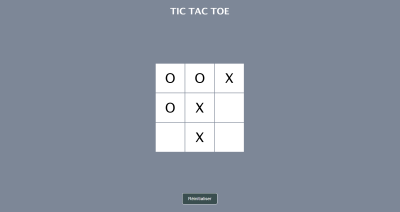
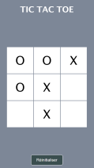

# Tic Tac Toe game

- Le Tic Tac Toe est un jeu pour deux joueurs joué sur une grille 3x3. 
- Le but du jeu est d'aligner trois de ses symboles (habituellement "X" ou "O") horizontalement, verticalement ou en diagonale, avant l'adversaire.

- Ce jeu est programmé en JavaScript et déployé sur Vercel.

- Jouer à ce jeu: [tic_tac_toe](https://tic-tac-toe-kappa-weld.vercel.app/)


<table>
  <tr>
    <td></td>
    <td></td>
  </tr>
</table>


---

## 1. Fonctionnalités

- **Grille interactive** : clique sur les cases pour jouer.
- **Changement automatique de joueur** : après chaque tour le joueur change.
- **Détection de gagnant** : si un joueur aligne trois symboles, un message de victoire est affiché.
- **Réinitialisation** : le jeu peut être réinitialisé une fois qu'il y a un gagnant ou un match nul.
---

## 2. Technologies utilisées

- **HTML** : structure de la page
- **CSS** : mise en page et style du jeu
- **JavaScript** : logique du jeu (ex: gestion des tours, détection de victoire... )
---

## 3. Installation

```
git clone https://github.com/Melissa-code/tic_tac_toe
cd tic_tac_toe
Ouvrir le fichier index.html dans le navigateur
```
---

## 4. Structure du projet

```
📂 tic-tac-toe/
 ┣ 📜 index.html       # Structure de la page HTML
 ┣ 📜 style.css        # Mise en forme de la grille et des éléments
 ┣ 📜 script.js        # Logique du jeu : gestion des tours, détection du gagnant, etc.
 ┗ 📜 README.md        # Documentation du projet
 ```
---

## 5. Author

- Melissa-code 
---


## 6. Fonctionnement du code

### 6.1. Créer la matrice qui va stocker les valeurs
- Un tableau à 2 dimensions représente la grille de jeu


### 6.2. Créer la fonction `caseJouee()`
- enregistre le symbole du joueur ("X" ou "O") dans la matrice et change de joueur
- Pour trouver l'indice de la matrice correspondant à la case cliquée:  

`cell 0 : 0,0` → (i=0, j=0)

`cell 1 : 0,1` → (i=0, j=1)

`cell 2 : 0,2` → (i=0, j=2)

`cell 3 : 1,0` → (i=1, j=0)

`cell 4 : 1,1` → (i=1, j=1)

`cell 5 : 1,2` → (i=1, j=2)

`cell 6 : 2,0` → (i=2, j=0)

`cell 7 : 2,1` → (i=2, j=1)

`cell 8 : 2,2` → (i=2, j=2)

- Soit : `i = Math.trunc(cell/3)` retourne la partie entiere d'un nombre (pour ligne)
- Soit : `j = cell % 3` ex: cell8:`8/3=2 reste 2` ou cell 3:`3/3=1 reste 0` (pour colonne)


### 6.3. Créer la fonction `afficheTour()`
- affiche X ou 0 sur la case 
- A l'inverse si l'on connaît les indices i et j : 
`cell = i*3+j`


### 6.4. Créer la fonction `changeJoueur()` 
- Elle alterne entre les joueurs après chaque tour 


### 6.5. Créer la function `enregistrerCombinaisonsJouees(matrice)` pour optimiser le code 
- Cette fonction permet de suivre les 8 combinaisons possibles à partir de la matrice du jeu:
Lignes: Ajoute les 3 lignes à l'array combinaisons[]
Colonnes: Ajoute les 3 colonnes à l'array combinaisons[]
Diagonales: Ajoute les 2 diagonales à l'array combinaisons[]


#### 6.5-1. Ajout des 3 lignes au tableau combinaisons
- Parcours de chaque ligne de la matrice  
- Ajoute la combinaison des 3 lignes (string) dans le tableau combinaisons 


#### 6.5-2. Ajout des 3 colonnes au tableau combinaisons
- Parcours de chaque colonne la matrice (inverse j et i dans les boucles for)
- Ajoute la combinaison des 3 colonnes dans le tableau combinaisons 


#### 6.5-3. Ajout des 2 diagonales au tableau combinaisons
- Parcours de chaque ligne de la matrice 
- 1re diagonale: `00 11 22 => i,i (j = i) donc if (matrice[i][i] === "X")`
- 2e diagonale : `02 11 20 => i, 2-i (j = 2-i) donc if (matrice[i][2 - i] === "X")`
- Ajoute la combinaison des 2 diagonales dans le tableau combinaisons 


### 6.6. Ajout d'une variable globale booléenne `jeuTermine` 
- Elle est utilisée pour empêcher les joueurs de jouer une fois la partie terminée


### 6.7. Créer la function `afficherGagnant()`
- Elle vérifie si la combinaison "XXX" ou "OOO" (string) est dans le tableau combinaisons 
- Si oui elle affiche un message annonçant le gagnant 
- Et vérouille le jeu (le joueur suivant ne peut plus jouer): `if (jeuTermine) return;`


### 6.8. créer une fonction `verifieMatriceRemplie() `
- Elle vérifie si toutes les cases sont remplies 
- et affiche un message si le jeu se termine sans gagnant


